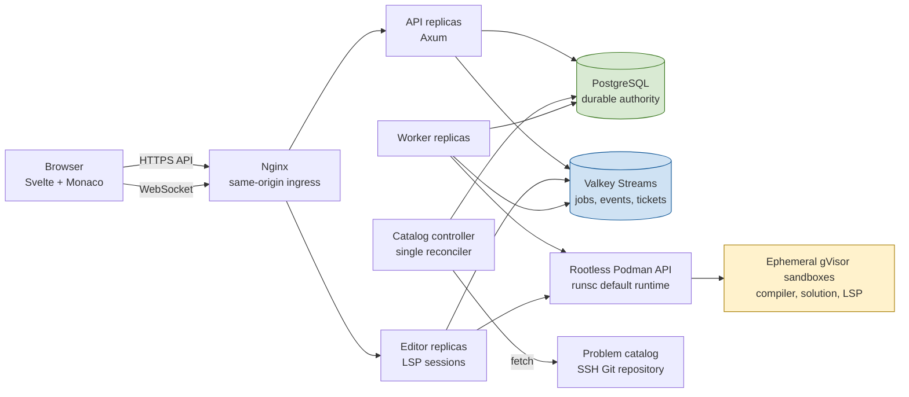
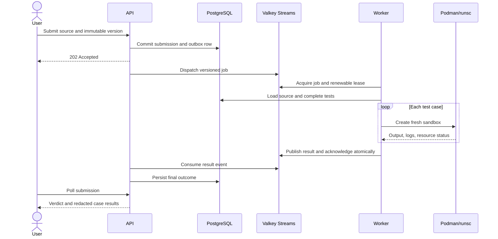
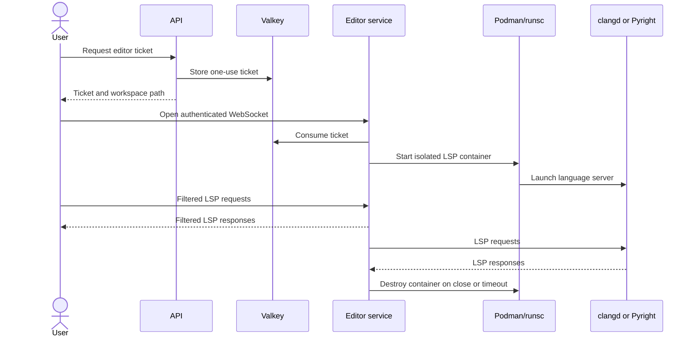
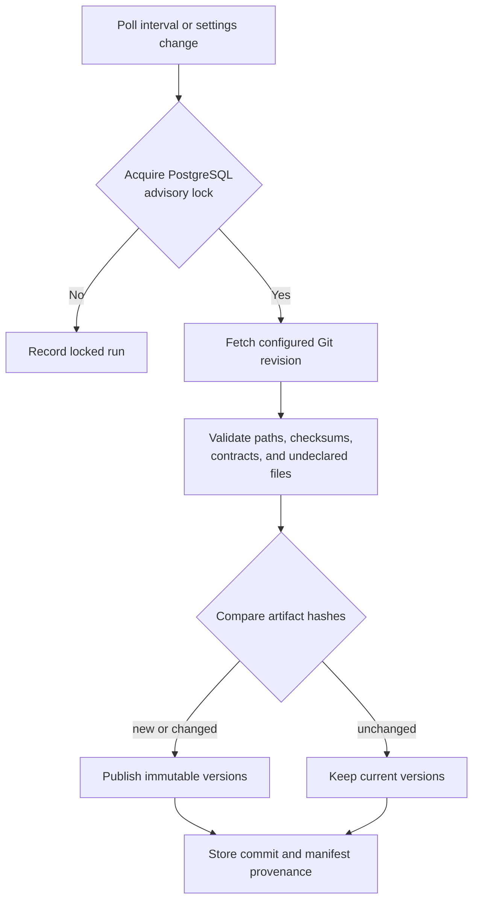

# Architecture and scaling

Locoder separates the trusted control plane from untrusted user execution. PostgreSQL is the durable authority, Valkey coordinates asynchronous work, and rootless Podman with gVisor provides the execution boundary.

Production Kubernetes is an alternate controller transport for the same boundary. `SANDBOX_BACKEND=podman` remains the default; `kubernetes` uses in-cluster credentials and creates a fresh Pod for compilation, each function case or stateful trace, and each editor session. Public API contracts, queued jobs, comparison logic, and verdicts are unchanged.

In Kubernetes, workers and editors hold namespace-scoped Pod and attach permissions in a dedicated Restricted-PSA sandbox namespace. API and catalog processes have no Kubernetes API credentials. Sandbox Pods have no service-account token or network access, require the configured gVisor RuntimeClass, and exchange submission material only over attach stdin/stdout. A controller timeout is recorded separately from an OOM termination; every path attempts immediate deletion, while expiry labels and a periodic sweeper recover after controller crashes.

## Intended architecture



The API never receives the Podman socket. Workers and editors do receive it and are trusted controller components. Submitted programs run without networking, credentials, the Podman socket, or access to other tests.

## Submission lifecycle



Submission creation and its outbox record commit in one database transaction. Dispatch is at least once. Worker leases, generation IDs, and attempt tokens fence stale executions; accepted final results are immutable. A database reconciliation pass republishes submissions that remain incomplete after the recovery window, allowing PostgreSQL to recover work even if Valkey loses stream state.

Function cases execute one call per fresh sandbox. Stateful cases construct one fresh instance and run the complete ordered operation trace in that sandbox. C++ compilation happens once per submission, and the trusted worker transfers the artifact into subsequent case sandboxes.

## Editor lifecycle



The editor has no PostgreSQL credentials. Tickets are short-lived and one use. The service restricts LSP methods and workspace URIs and enforces idle, lifetime, per-user, and process-wide session limits.

## Catalog reconciliation

The catalog controller fetches an SSH Git revision into a temporary bare repository, checks out the selected commit, validates the manifest and artifacts, and reconciles immutable problem versions in PostgreSQL.



The intended deployment runs exactly one catalog controller. Its database advisory lock is a defensive guard against overlapping reconciliation attempts during restarts or accidental duplicate processes.

## Scaling model

### API

API replicas are stateless apart from PostgreSQL and Valkey connections and can scale horizontally behind a reverse proxy. Session state lives in PostgreSQL, so HTTP requests do not require sticky routing. Scale this for HTTP concurrency, catalog browsing, polling, and result persistence. Size PostgreSQL connection limits before adding replicas.

Each API process currently runs dispatch and result-consumer loops. Stream coordination and database idempotency prevent duplicate finalization, but replicas increase both connection count and background-consumer activity.

### Workers

Workers are the primary submission-throughput scaling unit. They share the Valkey consumer group and can be added independently:

```sh
podman compose up -d --scale worker=4
```

`WORKER_CONCURRENCY` controls concurrent submissions inside each worker. Prefer more processes with conservative per-worker concurrency when failure containment matters. Approximate execution capacity with:

```text
worker replicas × WORKER_CONCURRENCY × active sandboxes per submission
```

A submission normally has one execution sandbox active at a time, plus compilation when required. Limits apply per sandbox, but the host still needs headroom for Podman, runsc, workers, and compilation bursts.

The Podman socket is node-local. Multi-host scaling requires one rootless Podman/runsc controller on every execution node and placement that connects each worker only to its local socket. Workers can share PostgreSQL and Valkey across nodes. Never expose the Podman socket over a public network.

### Editors

Editor replicas can scale horizontally, but each WebSocket remains attached to one replica for its lifetime. Tickets are shared through Valkey, so the initial connection can be load-balanced without sticky routing; the proxy must preserve the upgraded connection afterward.

Each replica enforces its own session capacity. Effective global capacity is the sum of replica limits, bounded by execution-node resources. Like workers, editors should control only a node-local Podman socket.

### PostgreSQL and Valkey

PostgreSQL is the source of truth and the first stateful bottleneck. Use durable storage, monitored backups, appropriate connection pooling, and a tested failover strategy before increasing application replicas. Read replicas do not directly accelerate the current write-heavy submission path without application changes.

Valkey carries jobs, result events, leases, and editor tickets. Enable persistence and disable eviction. It is recoverable coordination state rather than the durable submission authority, but losing it delays work until reconciliation. A highly available deployment reduces that delay.

### Catalog controller

Catalog reconciliation is a singleton responsibility and should not be horizontally scaled. PostgreSQL advisory locking defensively serializes overlapping attempts. Very large catalogs would benefit from incremental fetch and validation rather than additional controllers.

## Multi-node boundary

The current Compose topology targets one rootless Linux host. It can scale workers and editors on that host, but it does not schedule across machines. A multi-node deployment needs:

- shared PostgreSQL and Valkey services;
- ingress for API and editor replicas;
- rootless Podman/runsc on every worker/editor node;
- node-aware placement so controllers use only local Podman sockets;
- identical application and toolchain images on every node;
- centralized metrics and logs that continue to redact source and hidden tests.

The sandbox backend already separates create, start, collect, kill, and cleanup operations, leaving room for a future Kubernetes implementation. No Kubernetes manifests or execution backend are currently included.

## Security and resource boundaries

Sandboxes run as UID 65534 with a read-only root filesystem, dropped capabilities, no-new-privileges, no networking, bounded tmpfs, and CPU, memory, PID, file, output, and wall-clock limits. The controller verifies that Podman recorded runsc as the OCI runtime. Compilation receives source but no tests; execution wrappers receive only the current case through standard input.

Hidden inputs, expected values, outputs, and runtime diagnostics are redacted from learner-facing responses. Service logs must not include source, test content, WebSocket tickets, or sandbox runtime output.
